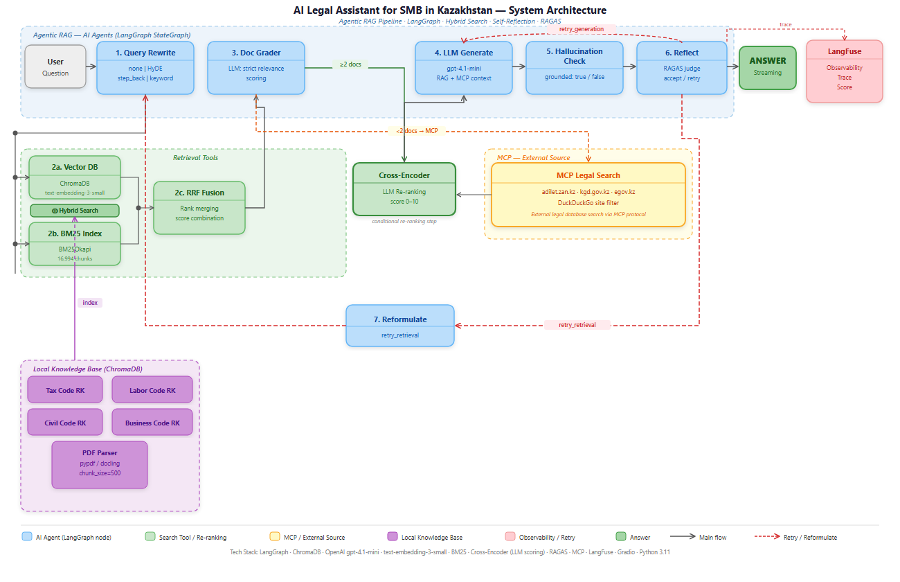

# Agentic RAG — Legal Assistant for SMB Kazakhstan

A conversational legal assistant for small and medium businesses in Kazakhstan, built on an agentic RAG pipeline with LangGraph, hybrid search, MCP integration, and automated quality evaluation.

**Author:** Guldana Kassym-Ashim  
**Program:** EPAM Generative AI for Software Development, 2026  
**GitHub:** https://github.com/Guldana2007/legal-assistant-smb-kazakhstan

---

## Overview

The system answers legal questions about Kazakhstan legislation by combining local document search (RAG) with live government web search via MCP (adilet.zan.kz, kgd.gov.kz, egov.kz). Supports Kazakh, English, and Russian. Every answer is grounded, hallucination-checked, and evaluated with RAGAS.

**Pipeline:**
```
1. Query Rewrite → 2a/2b. Hybrid Search (Vector DB + BM25)
  → 2c. RRF Fusion → 3. Doc Grader
  → 4. Cross-Encoder → 5. LLM Generate → 6. Hallucination Check → 7. Reflect
  └─ fallback: Doc Grader (<2 docs) → MCP → 4. Cross-Encoder
  └─ retry:    7. Reflect → 8. Reformulate → 1. Query Rewrite (up to 3 attempts)
```

## Architecture



**8 pipeline steps, 7 LLM agents:**

| # | Agent | Role |
|---|-------|------|
| 1 | Query Rewrite | Translates EN/KZ→RU; expands query (HyDE / Step-Back / Keyword / none) |
| 2a/2b | Hybrid Search | ChromaDB semantic (15 docs) + BM25 lexical (15 docs) in parallel |
| 2c | RRF Fusion | Reciprocal Rank Fusion (K=60) → top 8 docs |
| 3 | Doc Grader | Filters irrelevant chunks in parallel (LLM per doc) |
| 4 | Cross-Encoder | LLM re-ranking, scores 0–10 (gpt-4.1-mini) — always runs |
| 5 | LLM Generate | GPT-4.1-mini generates answer with source citations |
| 6 | Hallucination Check | Verifies every fact is grounded in retrieved context |
| 7 | Reflect | RAGAS judge (gpt-4o-mini); accepts or triggers retry |
| 8 | Reformulate | Rewrites query with new strategy for retry_retrieval |

**MCP fallback:** when Doc Grader finds < 2 relevant chunks, queries government portals live via custom MCP server. After MCP, always passes through Cross-Encoder.

---

## Tech Stack

| Component | Technology |
|-----------|-----------|
| Orchestration | LangGraph (StateGraph, TypedDict state) |
| Vector DB | ChromaDB (~17K chunks, 4 legal codes) |
| Embeddings | OpenAI text-embedding-3-small |
| LLM (agents) | GPT-4.1-mini |
| LLM (evaluation) | GPT-4o-mini (RAGAS judge) |
| Lexical search | BM25Okapi (rank-bm25) |
| Evaluation | RAGAS (Faithfulness + AnswerRelevancy, ~$0.001/eval) |
| Observability | LangFuse (full pipeline trace, token costs) |
| UI | Gradio 6.x (streaming, multilingual) |
| MCP server | Custom FastMCP (adilet.zan.kz, kgd.gov.kz, egov.kz) |

**Cost:** ~$0.01 per query — up to 10,000× cheaper than a lawyer ($20–$100/hr).

---

## Knowledge Base

Documents indexed in ChromaDB:
- Трудовой кодекс РК (Labor Code)
- Налоговый кодекс РК (Tax Code)
- Гражданский кодекс РК (Civil Code)
- Предпринимательский кодекс РК (Entrepreneurship Code)

Users can upload additional PDF/DOCX files at runtime via the **Upload** tab — they are chunked and indexed into ChromaDB automatically.

---

## Requirements

- Python 3.11+
- OpenAI API key
- Docker (optional — for LangFuse observability)

---

## Installation

```bash
# 1. Clone the repository
git clone https://github.com/Guldana2007/legal-assistant-smb-kazakhstan.git
cd legal-assistant-smb-kazakhstan

# 2. Create and activate virtual environment
python -m venv .venv
# Windows:
.venv\Scripts\activate
# macOS/Linux:
source .venv/bin/activate

# 3. Install dependencies
pip install -r requirements.txt

# 4. Configure environment variables
cp .env.example .env
# Edit .env and add your OpenAI API key
```

---

## Environment Variables

Create a `.env` file in the project root:

```env
OPENAI_API_KEY=sk-...

# LangFuse (optional — for observability)
LANGFUSE_PUBLIC_KEY=pk-lf-...
LANGFUSE_SECRET_KEY=sk-lf-...
LANGFUSE_HOST=http://localhost:3000
```

---

## Running

### 1. Start LangFuse (optional)
```bash
docker-compose -f docker-compose.langfuse.yml up -d
# Dashboard: http://localhost:3000
```

### 2. Index documents
```bash
python ingest.py
```

### 3. Launch the app
```bash
python app_agentic_rag.py
# Open: http://localhost:7861
```

---

## Usage

1. Select language: **Қазақша / English / Русский**
2. Type a legal question or click a sample question
3. Adjust **Max Attempts** (1–5) and **Query Expansion** strategy if needed
4. Click **Submit** — the answer streams with live Agent Trace
5. RAGAS scores (Faithfulness + Answer Relevancy) appear ~5 sec after the answer

### Upload custom documents

Go to the **Upload** tab to add your own PDF or DOCX files. They will be chunked and indexed automatically into ChromaDB.

---

## Tests

```bash
# Fast unit tests — no LLM calls (~3 seconds)
python -m pytest tests/ -v -m unit

# Full integration tests — real LLM calls (~3-5 minutes)
python -m pytest tests/ -v -m integration

# All 24 tests
python -m pytest tests/ -v
```

**24 tests total:** 10 unit + 14 integration  
Covers: Query Rewrite, RRF Fusion, Doc Grader, Hallucination Check, full pipeline (positive + negative scenarios), multilingual mode, adversarial inputs.

---

## Project Structure

```
├── app_agentic_rag.py              # Gradio UI + streaming handler
├── langgraph_rag.py                # LangGraph StateGraph (pipeline controller)
├── ingest.py                       # Document indexing script
├── eval_run.py                     # Batch RAGAS evaluation runner
├── pytest.ini                      # Test markers (unit / integration)
├── agents/
│   ├── query_rewrite.py            # Step 1: Query expansion + translation
│   ├── vector_db.py                # Step 2a: Semantic search (ChromaDB, 15 docs)
│   ├── bm25_index.py               # Step 2b: Lexical search (BM25, 15 docs)
│   ├── rrf_fusion.py               # Step 2c: RRF Fusion → 8 docs
│   ├── doc_grader.py               # Step 3: Document grading (parallel LLM)
│   ├── cross_encoder.py            # Step 4: LLM re-ranking (score 0–10)
│   ├── llm_generate.py             # Step 5: Answer generation + citations
│   ├── hallucination_check.py      # Step 6: Grounding verification
│   ├── mcp_legal_search.py         # MCP fallback: gov portals
│   └── shared.py                   # LangFuse + utilities
├── mcp_server/
│   └── legal_kz_server.py          # FastMCP server for Kazakhstan legal DB
├── tests/
│   └── test_pipeline.py            # 24 tests (10 unit + 14 integration)
├── eval_results/                   # RAGAS evaluation output (JSON + TXT)
├── docker-compose.langfuse.yml     # LangFuse + PostgreSQL
├── architecture_diagram.png        # System architecture diagram
└── architecture_diagram.svg        # Architecture diagram (vector)
```

---

## Evaluation Results

RAGAS scores from `eval_results/eval_2026-05-02_00-48.txt` (8 questions, scale 0–10):

| Query | Faith | Relev | Score | Source |
|-------|-------|-------|-------|--------|
| Min wage 2026 | 10.0 | 9.9 | 10.0 | MCP ✅ |
| Civil Code statute of limitations | 10.0 | 5.7 | 7.8 | Local ✅ |
| ИП registration | 6.7 | 8.2 | 7.4 | Local+MCP ✅ |
| Labor Code vacation days | 6.7 | 8.4 | 7.5 | Local ✅ |
| КПН tax rates for SMB | 6.0 | 6.7 | 6.3 | MCP ✅ |

**Average: 6.2/10 overall · Pass rate (≥7.0): 4/8 questions**

Low scores on edge cases: out-of-scope questions (future law changes) and complex tax queries where MCP returned partial data.
