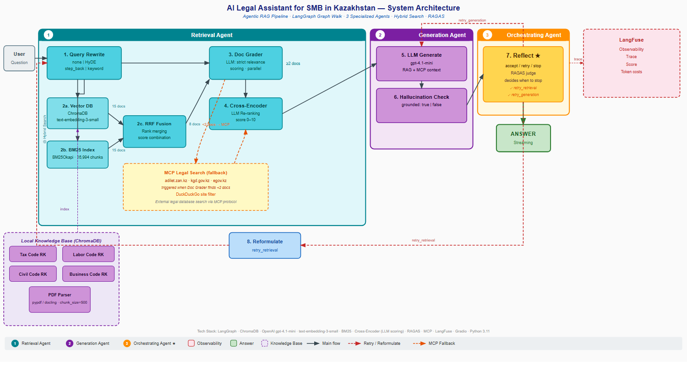

# Agentic RAG — Legal Assistant for SMB Kazakhstan

A conversational legal assistant for small and medium businesses in Kazakhstan, built on an agentic RAG pipeline with LangGraph, hybrid search, MCP integration, and automated quality evaluation.

**Author:** Guldana Kassym-Ashim  
**Program:** EPAM Generative AI for Software Development, 2026  
**GitHub:** https://github.com/Guldana2007/legal-assistant-smb-kazakhstan

---

## Overview

The system answers legal questions about Kazakhstan legislation by combining local document search (RAG) with live government web search via MCP (adilet.zan.kz, kgd.gov.kz, egov.kz). Supports Kazakh, English, and Russian. Every answer is grounded, hallucination-checked, and evaluated with RAGAS.

**Pipeline:**
```
1. Query Rewrite → 2a. Vector DB → 2b. BM25 → 2c. RRF Fusion → 3. Doc Grader
  → 4. Cross-Encoder → 5. LLM Generate → 6. Hallucination Check → 7. Reflect
  └─ fallback:          Doc Grader (<2 docs) → MCP → 4. Cross-Encoder
  └─ retry_retrieval:   7. Reflect → 8. Reformulate → 1. Query Rewrite (up to 3 attempts)
  └─ retry_generation:  7. Reflect → 5. LLM Generate (skips retrieval, faithfulness ≥ 5)
```

## Architecture



**LangGraph Graph Walk — 3 specialized agents, 8 pipeline steps:**

| # | Agent | Steps | Role |
|---|-------|-------|------|
| 1 | **Retrieval Agent** | 1–4 + MCP fallback | Query rewrite, hybrid search (Vector DB + BM25), RRF fusion, doc grading, cross-encoder re-ranking. Falls back to MCP live search when fewer than 2 relevant docs are found. |
| 2 | **Generation Agent** | 5–6 | Generates the answer (GPT-4.1-mini) with source citations; verifies every fact is grounded in retrieved context. |
| 3 | **Orchestrating Agent** | 7–8 | RAGAS judge — autonomously decides: accept answer / retry retrieval / retry generation / stop. The only node that makes independent decisions. |

**Pipeline steps:**

| Step | Name | Description |
|------|------|-------------|
| 1 | Query Rewrite | Translates EN/KZ→RU; expands query (HyDE / Step-Back / Keyword / none) |
| 2a/2b | Hybrid Search | ChromaDB semantic (15 docs) + BM25 lexical (15 docs) |
| 2c | RRF Fusion | Reciprocal Rank Fusion (K=60) → top 8 docs |
| 3 | Doc Grader | Filters irrelevant chunks in parallel (LLM per doc) |
| 4 | Cross-Encoder | LLM re-ranking, scores 0–10 |
| 5 | LLM Generate | GPT-4.1-mini generates answer with source citations |
| 6 | Hallucination Check | Verifies every fact is grounded in retrieved context |
| 7 | Reflect ★ | Fast-accept on attempt 0 if grounded; else runs RAGAS and decides: accept (≥7/10) / retry_retrieval (faithfulness <5) / retry_generation (score <7, faithfulness ≥5) |
| 8 | Reformulate | Rewrites query with next expansion strategy; used only for retry_retrieval |

**MCP fallback:** when Doc Grader finds < 2 relevant chunks, queries government portals live via custom MCP server. After MCP, always passes through Cross-Encoder.

**Two retry paths:**
- `retry_retrieval` — full restart: Reformulate → Query Rewrite → new retrieval (triggered when faithfulness < 5)
- `retry_generation` — regeneration only: goes directly back to LLM Generate without new retrieval (triggered when score < 7 but faithfulness ≥ 5)

**RAGAS timing:** on the first attempt Reflect uses a fast path — accepts immediately if the answer is grounded, without running RAGAS. RAGAS scores appear ~5 seconds after the answer, computed asynchronously.

---

## Tech Stack

| Component | Technology |
|-----------|-----------|
| Orchestration | LangGraph (StateGraph, TypedDict state) |
| Vector DB | ChromaDB (~17K chunks, 4 legal codes) |
| Embeddings | OpenAI text-embedding-3-small |
| LLM (agents) | GPT-4.1-mini |
| LLM (evaluation) | GPT-4o-mini (RAGAS judge) |
| Lexical search | BM25Okapi (rank-bm25) |
| Evaluation | RAGAS (Faithfulness + AnswerRelevancy, ~$0.001/eval) |
| Observability | LangFuse (full pipeline trace, token costs) |
| UI | Gradio 6.x (streaming, multilingual) |
| MCP server | Custom FastMCP (adilet.zan.kz, kgd.gov.kz, egov.kz) |

**Cost:** ~$0.01 per query — up to 10,000× cheaper than a lawyer ($20–$100/hr).

---

## Knowledge Base

Documents indexed in ChromaDB:
- Трудовой кодекс РК (Labor Code)
- Налоговый кодекс РК (Tax Code)
- Гражданский кодекс РК (Civil Code)
- Предпринимательский кодекс РК (Entrepreneurship Code)

Users can upload additional PDF/DOCX files at runtime via the **Upload** tab — they are chunked and indexed into ChromaDB automatically.

---

## Requirements

- Python 3.11+
- OpenAI API key
- Docker (optional — for LangFuse observability)

---

## Installation

```bash
# 1. Clone the repository
git clone https://github.com/Guldana2007/legal-assistant-smb-kazakhstan.git
cd legal-assistant-smb-kazakhstan

# 2. Create and activate virtual environment
python -m venv .venv
# Windows:
.venv\Scripts\activate
# macOS/Linux:
source .venv/bin/activate

# 3. Install dependencies
pip install -r requirements.txt

# 4. Configure environment variables
cp .env.example .env
# Edit .env and add your OpenAI API key
```

---

## Environment Variables

Create a `.env` file in the project root:

```env
OPENAI_API_KEY=sk-...

# LangFuse (optional — for observability)
LANGFUSE_PUBLIC_KEY=pk-lf-...
LANGFUSE_SECRET_KEY=sk-lf-...
LANGFUSE_HOST=http://localhost:3000
```

---

## Running

### 1. Start LangFuse (optional)
```bash
docker-compose -f docker-compose.langfuse.yml up -d
# Dashboard: http://localhost:3000
```

### 2. Index documents
```bash
python ingest.py
```

### 3. Launch the app
```bash
python app_agentic_rag.py
# Open: http://localhost:7861
```

---

## Usage

1. Select language: **Қазақша / English / Русский**
2. Type a legal question or click a sample question
3. Adjust **Max Attempts** (1–5) and **Query Expansion** strategy if needed
4. Click **Submit** — the answer streams with live Agent Trace
5. RAGAS scores (Faithfulness + Answer Relevancy) appear ~5 sec after the answer

### Upload custom documents

Go to the **Upload** tab to add your own PDF or DOCX files. They will be chunked and indexed automatically into ChromaDB.

---

## Tests

```bash
# Fast unit tests — no LLM calls (~3 seconds)
python -m pytest tests/ -v -m unit

# Full integration tests — real LLM calls (~3-5 minutes)
python -m pytest tests/ -v -m integration

# All 24 tests
python -m pytest tests/ -v
```

**24/24 tests pass:** 10 unit + 14 integration ✅ (verified 2026-05-07)  
Covers: Query Rewrite, RRF Fusion, Doc Grader, Hallucination Check, full pipeline (positive + negative scenarios), multilingual mode, adversarial inputs.

---

## Project Structure

```
├── app_agentic_rag.py              # Gradio UI + streaming handler
├── langgraph_rag.py                # LangGraph StateGraph (pipeline controller)
├── ingest.py                       # Document indexing script
├── eval_run.py                     # Batch RAGAS evaluation runner
├── pytest.ini                      # Test markers (unit / integration)
├── agents/
│   ├── query_rewrite.py            # Step 1: Query expansion + translation
│   ├── vector_db.py                # Step 2a: Semantic search (ChromaDB, 15 docs)
│   ├── bm25_index.py               # Step 2b: Lexical search (BM25, 15 docs)
│   ├── rrf_fusion.py               # Step 2c: RRF Fusion → 8 docs
│   ├── doc_grader.py               # Step 3: Document grading (parallel LLM)
│   ├── cross_encoder.py            # Step 4: LLM re-ranking (score 0–10)
│   ├── llm_generate.py             # Step 5: Answer generation + citations
│   ├── hallucination_check.py      # Step 6: Grounding verification
│   ├── mcp_legal_search.py         # MCP fallback: gov portals
│   └── shared.py                   # LangFuse + utilities
├── mcp_server/
│   └── legal_kz_server.py          # FastMCP server for Kazakhstan legal DB
├── tests/
│   └── test_pipeline.py            # 24 tests (10 unit + 14 integration)
├── eval_results/                   # RAGAS evaluation output (JSON + TXT)
├── docker-compose.langfuse.yml     # LangFuse + PostgreSQL
├── architecture_diagram_v4.png     # Final architecture diagram (3 agents)
├── architecture_diagram_v4.svg     # Architecture diagram — vector
├── Executive_Summary.md            # 1–2 page project overview
├── Self_Review.md                  # Architecture decisions and trade-offs
├── Capstone_Presentation.pptx      # Slide deck
└── .env.example                    # Environment variable template
```

---

## Evaluation Results

RAGAS scores from live English testing session (2026-05-07, scale 0–10):

| Query | Faith | Relev | Score |
|-------|-------|-------|-------|
| Statute of limitations (Civil Code) | 10.0 | 9.8 | **9.9** |
| Employer liability for delayed salary | 10.0 | 8.9 | **9.4** |
| Vacation days (Labor Code) | 10.0 | 8.4 | **9.2** |
| Labor Code 2025 amendments | 8.6 | 9.6 | **9.1** |
| Tax Code 2025 amendments | 5.7 | 9.6 | **7.6** |
| VAT definition (Tax Code) | 3.3 | 7.3 | 5.3 |
| Minimum wage 2026 | 10.0 | 0.0 | 5.0 |

**Average: 7.9/10 overall · Pass rate (≥7.0): 5/7 questions**

Low scores on two edge cases: the VAT question pulled an outdated 2014 invoice chunk instead of the definition, and the min wage question returned how the wage is set by law rather than the actual 2026 figure — a retrieval gap, not a generation error.

---

## Known Limitations

**LangFuse shows $0.00 cost.** The integration uses the Python SDK's `trace()` method to log pipeline-level data (input, output, RAGAS scores, retry metadata). Individual OpenAI API calls are not wrapped as LangFuse generation spans, so token counts and per-call costs are not captured inside LangFuse. Actual cost (~$0.01/query) is tracked in the OpenAI Dashboard. The SDK approach was chosen over LangChain callbacks because callbacks conflict with Gradio's streaming generator pattern.

**MCP Faithfulness depends on snippet content quality, not URL presence.** When MCP retrieves snippets that directly contain the answer, the LLM grounds its response in that content and RAGAS Faithfulness is high. When MCP retrieves off-topic or general snippets that do not contain the specific answer, the LLM fills gaps from its own knowledge — RAGAS then scores Faithfulness low because the specific details cannot be traced back to the retrieved context. Answer Relevancy remains high in both cases.

Examples:
- "What are the sanitary requirements for opening a food service establishment?" → MCP found `adilet.zan.kz` food safety law with specific content → Faithfulness **10.0/10**
- "How do I check the status of my business registration on egov.kz?" → MCP snippets from egov.kz explicitly mentioned "Personal Account → My applications" → Faithfulness **10.0/10**
- "What are the current state duty fees for registering a business?" → MCP returned general investment/passport pages without fee figures → LLM used own knowledge → Faithfulness **2.0/10**

---

## Future Improvements

- **MCP query optimization** — send a short keyword query to DuckDuckGo instead of the full question, to improve URL resolution rate and reduce snippet-only results
- **Full-page MCP scraping** — when a URL is found, scrape the full page instead of the snippet to provide richer context for the LLM and improve Faithfulness scores
- **Expanded knowledge base** — add environmental, licensing, and IP law codes to cover more SMB scenarios
- **Kazakh-language embeddings** — add a dedicated KZ-language embedding model alongside the current RU/EN pipeline
